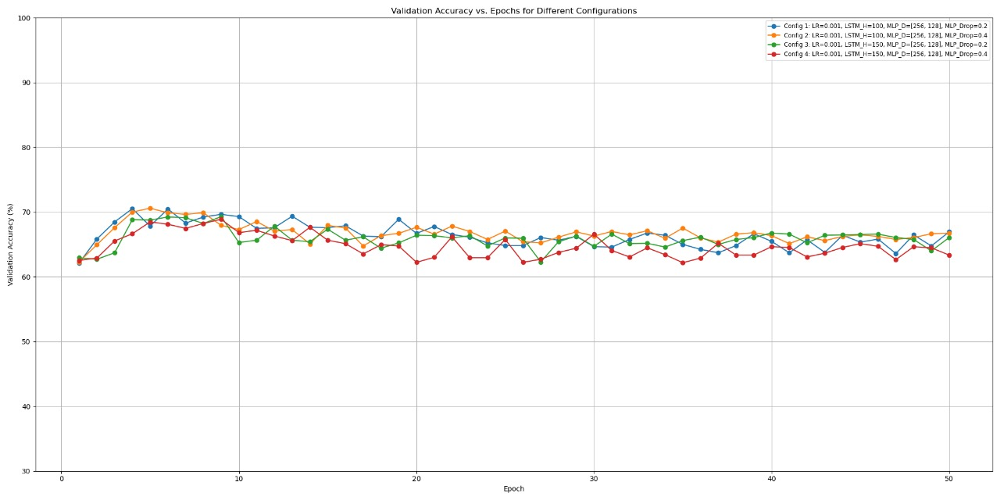
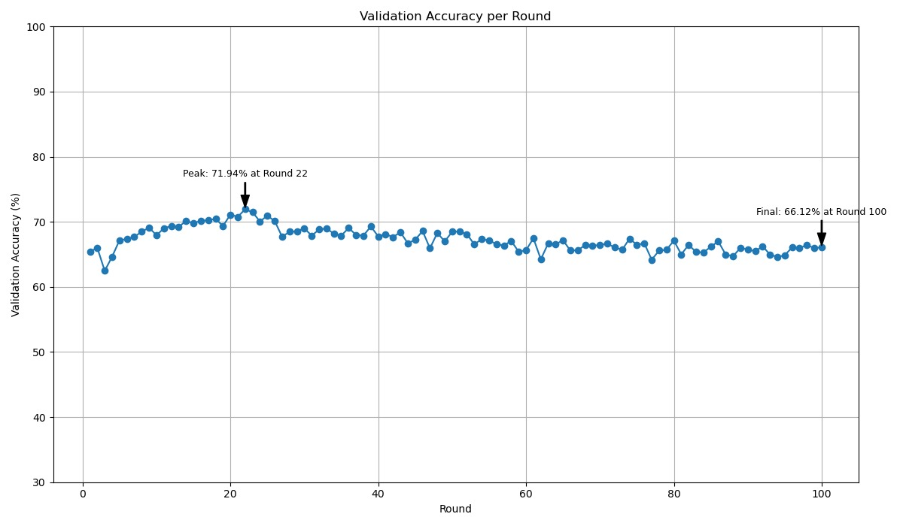
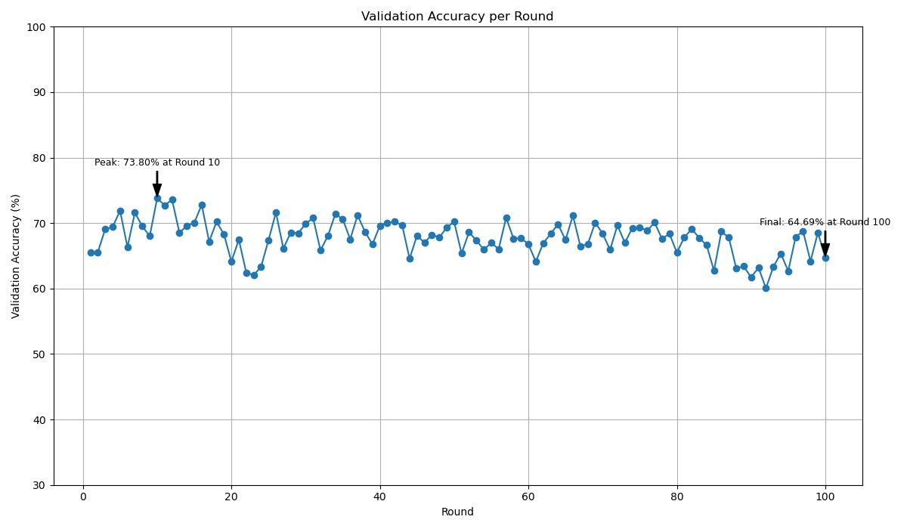
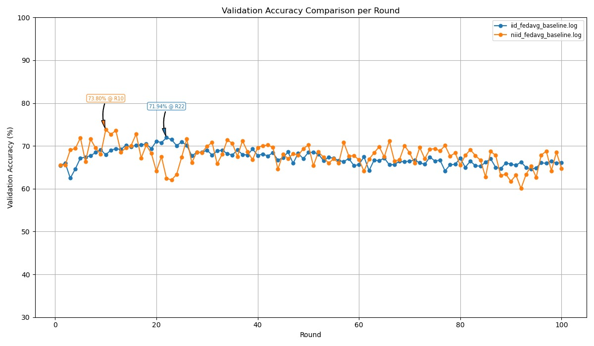
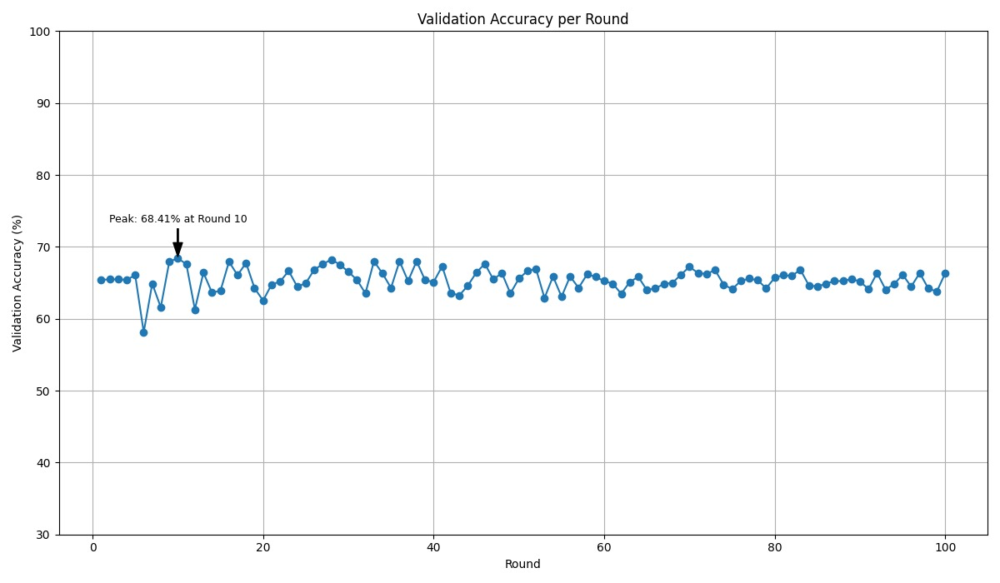
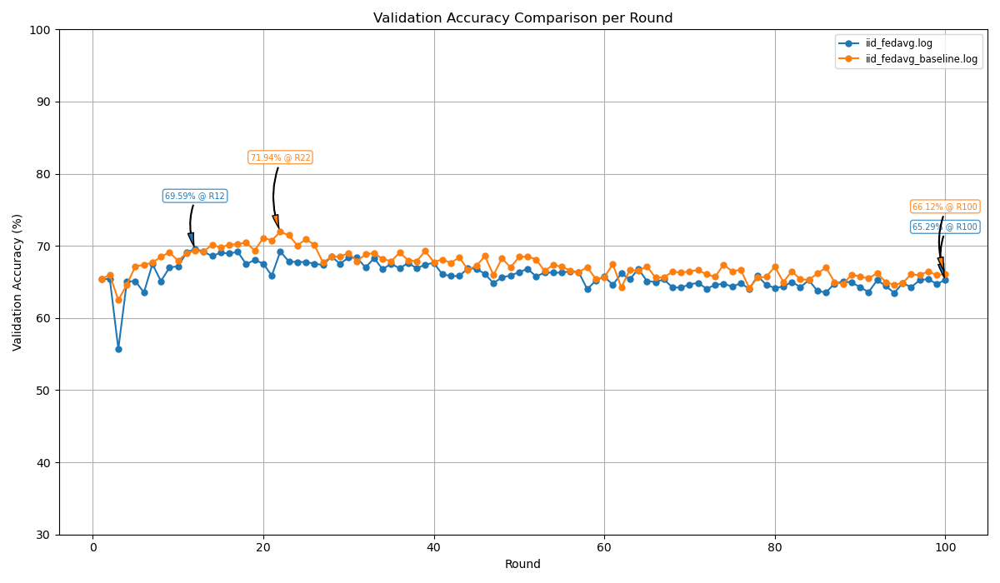
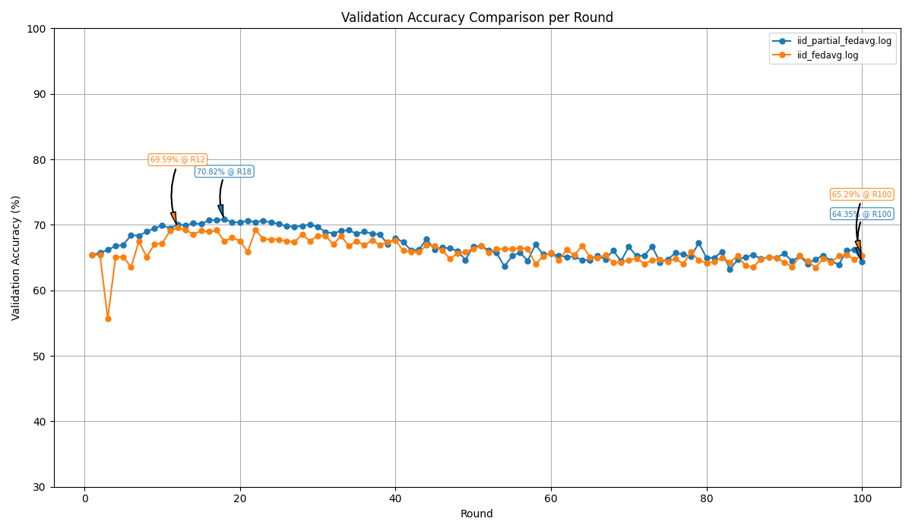

# MultiFL
The codebase for our preliminary work on extending UnifyFL.

- The model should be a encoders, fusion layer and classifier type architecture with one encoder for each modality and one encoder for each classifier
- We are trying two types of aggregation techniques:
	- **Full Aggregation :** The whole model is trained on a client including the encoders and classifier and the whole model is aggregated similar to standard fedavg
	- **Partial Aggregation :** In this strategy only the encoders and fusion layers are aggregated and the classifier is kept private. This should in theory allow for more flexibility in the classifier architecture
- **Custom Strategy :** We designed a custom strategy in flower to handle cases with missing modalities where a few clients don't have certain modalities of data and we ran a few tests to confirm the strategy's accuracy in an ideal scenario with no missing modalities and an IID distribution

## Results

### Centralized Training
- These are the results for normal centralized training on the dataset, with different hyperparameters

### FedAvg Baselines
- Full aggregation on IID data

- Full aggregation on NIID data

- Comparison

### Custom Strategy with Full Aggregation
- Full aggregation on IID data with equal split of clients and modalities

### Custom Strategy with Partial Aggregation

### Comparisons
- **IID Fedavg Baseline VS Custom Full Aggregation**

- **IID Fedavg Custom Full VS Partial Aggregation**

## Conclusion
- We can see that the trends for custom strategy, fedavg baseline and centralised training are similar indicating that the strategy is comparable to the baseline results